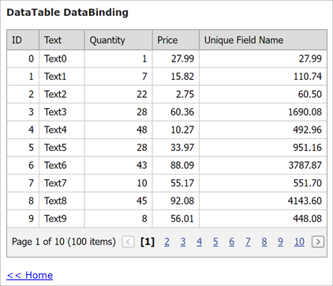

<!-- default badges list -->

[](https://supportcenter.devexpress.com/ticket/details/E3530)
[](https://docs.devexpress.com/GeneralInformation/403183)
[](#does-this-example-address-your-development-requirementsobjectives)
<!-- default badges end -->

# Grid View for MVC - How to Bind a Grid to Standard In-Memory Data Sources (DataTable, List<T>)

This example shows how to bind [MVC GridView Extension](https://docs.devexpress.com/AspNetMvc/8966/components/grid-view) [columns](https://docs.devexpress.com/AspNetMvc/16149/components/grid-view/concepts/data-representation-basics/columns) to the following data sources:

* The [ADO.NET DataTable](https://docs.microsoft.com/en-us/dotnet/framework/data/adonet/dataset-datatable-dataview/datatables) - [DataTableDataBinding](./CS/CS/Views/Home/DataTableDataBinding.cshtml) View / [DataTableDataBindingPartial](./CS/CS/Views/Home/DataTableDataBindingPartial.cshtml) Partial View
* The Typed List ([List&lt;T&gt;](https://docs.microsoft.com/en-us/dotnet/api/system.collections.generic.list-1?view=net-6.0)) - [TypedListDataBinding](./CS/CS/Views/Home/TypedListDataBinding.cshtml) View / [TypedListDataBindingPartial](./CS/CS/Views/Home/TypedListDataBindingPartial.cshtml) Partial View

Also, this example demonstrates how to create an [unbound column](https://docs.devexpress.com/AspNetMvc/16859/components/grid-view/concepts/data-representation-basics/columns/unbound-columns) and populate it with data.



Use the [GridViewSettings.Columns](https://docs.devexpress.com/AspNetMvc/DevExpress.Web.Mvc.GridViewSettings.Columns?p=netframework) property to access the collection of grid columns.

Add four columns and bind them to the "ID", "Text", "Quantity", "Price" data source fields:

```cshtml
settings.Columns.Add("ID");
settings.Columns.Add("Text");
settings.Columns.Add("Quantity");
settings.Columns.Add("Price");
```

Then, add an unbound column whose values are calculated based on the values of bound columns. Use the unbound column's [FieldName](https://docs.devexpress.com/AspNet/DevExpress.Web.GridViewDataColumn.FieldName) and [UnboundType](https://docs.devexpress.com/AspNet/DevExpress.Web.GridViewDataColumn.UnboundType) properties to specify the column name and value type. Calculate column values in the [CustomUnboundColumnData](https://docs.devexpress.com/AspNetMvc/DevExpress.Web.Mvc.GridViewSettings.CustomUnboundColumnData?p=netframework) event handler:

```cshtml
settings.Columns.Add(unboundColumn => {
    unboundColumn.FieldName = "UniqueFieldName";
    unboundColumn.UnboundType = DevExpress.Data.UnboundColumnType.Decimal;
});
settings.CustomUnboundColumnData = (sender, e) => {
    if (e.Column.FieldName == "UniqueFieldName") {
        int quantity = Convert.ToInt32(e.GetListSourceFieldValue("Quantity"));
        decimal price = (decimal)e.GetListSourceFieldValue("Price");
        e.Value = quantity * price;
    }
};
```

## Files to Look At

* [Model.cs](./CS/CS/Models/Model.cs) (VB: [Model.vb](./VB/CS/Models/Model.vb))
* [DataTableDataBinding.cshtml](./CS/CS/Views/Home/DataTableDataBinding.cshtml)
* [DataTableDataBindingPartial.cshtml](./CS/CS/Views/Home/DataTableDataBindingPartial.cshtml)
* [TypedListDataBinding.cshtml](./CS/CS/Views/Home/TypedListDataBinding.cshtml)
* [TypedListDataBindingPartial.cshtml](./CS/CS/Views/Home/TypedListDataBindingPartial.cshtml)

## Documentation

* [MVC GridView Extension](https://docs.devexpress.com/AspNetMvc/8966/components/grid-view)
* [Grid View - Columns](https://docs.devexpress.com/AspNetMvc/16149/components/grid-view/concepts/data-representation-basics/columns)
* [Grid View - Binding to Data](https://docs.devexpress.com/AspNetMvc/14722/components/grid-view/concepts/binding-to-data)

## More Examples

* [GridView - How to Edit in Memory Data Source](https://github.com/DevExpress-Examples/gridview-how-to-edit-in-memory-data-source-e3983)
* [GridView - How to Specify a Custom EditForm Template](https://github.com/DevExpress-Examples/gridview-how-to-specify-a-custom-editform-template-e3998)
<!-- feedback -->
## Does this example address your development requirements/objectives?

[](https://www.devexpress.com/support/examples/survey.xml?utm_source=github&utm_campaign=mvc-gridview-bind-to-in-memory-data-sources&~~~was_helpful=yes) [](https://www.devexpress.com/support/examples/survey.xml?utm_source=github&utm_campaign=mvc-gridview-bind-to-in-memory-data-sources&~~~was_helpful=no)

(you will be redirected to DevExpress.com to submit your response)
<!-- feedback end -->
